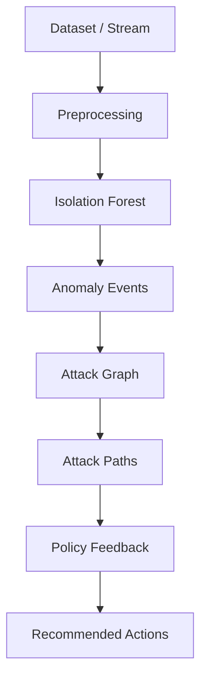

# RAPIDS
Real-time, attack-path aware intrusion detection system with streaming detection, graph-based risk analysis, and policy feedback.

## What It Does
- Ingests flow data, trains an Isolation Forest baseline, and detects anomalies in real time.
- Builds an attack graph, propagates risk, and computes top attack paths.
- Recommends containment actions and estimates risk reduction.

## Architecture



## Quickstart

```bash
python -m venv venv
venv\Scripts\activate
pip install -e .
```

## Configuration
Edit config values in `config/config.yaml`:
- Dataset path
- Streaming parameters
- Redis connection
- Reasoning engine parameters

## CLI
Run the main workflows using the CLI:

```bash
rapids offline
rapids stream
rapids benchmark --dataset datasets/sample.csv --max-rows 5000
```

## Streaming IDS
Start Redis, then run streaming IDS:

```bash
rapids stream
```

You will see:
- `[STATS]` throughput
- `[ALERT]` anomaly detections
- `[PATH]` attack paths with risk
- `[ACTION]` containment recommendations

## Phase 6 Benchmarking
Run the end-to-end benchmark and generate a report:

```bash
rapids benchmark --dataset datasets/sample.csv --max-rows 5000
```

This produces a JSON report at `evaluation/benchmark_report.json` with:
- Detection throughput and latency (mean, p50, p95)
- Detection metrics (precision, recall, F1, FPR)
- False positive stress metrics
- Attack-path hit rate

## Phase Checks
Run Phase 4-6 validation checks:

```bash
python phase_checks.py --dataset datasets/sample.csv --max-rows 5000
```

## Tests
Run unit tests:

```bash
python -m pytest
```

## Demo Script (Narrated)
1. Introduce RAPIDS and the goal (real-time IDS with attack-path reasoning).
2. Run the CLI: `rapids stream`.
3. Point out the `[STATS]` throughput and anomaly alerts.
4. Highlight the `[PATH]` output and explain risk scoring.
5. Show `[ACTION]` and `[REDUCTION]` as policy recommendations.
6. Run the benchmark: `rapids benchmark --dataset datasets/sample.csv --max-rows 5000`.
7. Open `evaluation/benchmark_report.json` and summarize throughput, latency, F1, FPR.
8. Close with architecture diagram and repo structure (tests, config, CLI).

## Project Structure
- `src/rapids/` package root
- `src/rapids/core/` config, logging, and Redis helpers
- `src/rapids/detection/` data loading and anomaly model training
- `src/rapids/reasoning/` attack graph, path engine, and policy feedback
- `src/rapids/streaming/` Redis producer/consumer pipeline
- `src/rapids/evaluation/` benchmarks and phase checks
- `tests/` unit tests
