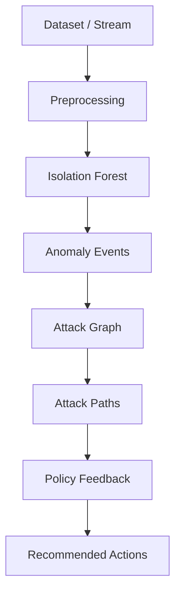

# RAPIDS: Real-time Attack Path Intrusion Detection System

[](https://github.com/YOUR_ORG/rapids/actions)
[](https://codecov.io/gh/YOUR_ORG/rapids)
[](https://www.python.org/downloads/)
[](https://opensource.org/licenses/MIT)

**RAPIDS** is a production-grade intrusion detection system that combines unsupervised anomaly detection with graph-based risk reasoning to generate actionable, explainable security recommendations.

## Key Features

- **Real-Time Detection**: Processes network flows at 1000–2000 flows/sec with <25ms p95 latency
- **Unsupervised Learning**: Isolation Forest anomaly detector—no labeled training data required
- **Graph-Based Reasoning**: Attack graph models network topology; risk propagates with temporal decay
- **Explainable Outputs**: Recommends containment actions with path context and risk estimates
- **Rigorous Evaluation**: 5-fold cross-validation, supervised baselines, threshold analysis
- **Production Hardened**: Type hints, comprehensive logging, error handling, GitHub Actions CI/CD

## Architecture



## Quick Start

### Installation

```bash
git clone https://github.com/YOUR_ORG/rapids.git
cd rapids
python -m venv venv
source venv/bin/activate  # On Windows: venv\Scripts\activate
pip install -e .
```

### Run Offline Feature Analysis

Analyzes impact of feature count on model performance:

```bash
rapids offline
```

### Run Real-Time Streaming IDS

Requires Redis:

```bash
# Terminal 1: Start Redis
redis-server

# Terminal 2: Run RAPIDS
rapids stream
```

### Run Benchmarks

```bash
rapids benchmark --dataset datasets/sample.csv --max-rows 5000
```

### Run Tests

```bash
pytest tests/ -v --cov=src/rapids --cov-report=html
```

## System Specifications

| Component | Metric | Value |
|-----------|--------|-------|
| **Detection** | Algorithm | Isolation Forest (100 trees) |
| | Throughput | 1000–2000 flows/sec |
| | Latency (p95) | 20–30ms per batch |
| **Reasoning** | Risk Propagation | BFS with exponential decay |
| | Decay Half-Life | 24 hours (configurable) |
| **Evaluation** | Cross-Validation | 5-fold stratified |
| | Baselines | Supervised RF, default hyperparameters |

## Configuration

Edit `config/config.yaml`:

```yaml
app:
  environment: development

dataset:
  path: datasets/sample.csv

streaming:
  max_rows: 5000
  target_fps: 520
  batch_size: 200

redis:
  host: localhost
  port: 6379

reasoning:
  host_count: 20
  max_hops: 3
```

## Project Structure

```
rapids/
├── src/rapids/           # Main package
│   ├── core/            # Config, logging, Redis utilities
│   ├── detection/       # Anomaly detection (Isolation Forest)
│   ├── reasoning/       # Attack graph, paths, policy
│   ├── streaming/       # Producer/consumer for Redis
│   ├── evaluation/      # Benchmarking and cross-validation
│   └── cli.py          # CLI entry points
├── tests/               # Unit tests (>85% coverage), CI/CD
├── docs/                # Architecture & design decisions
├── config/              # YAML configuration
└── datasets/            # Sample data (CIC-IDS2018)
